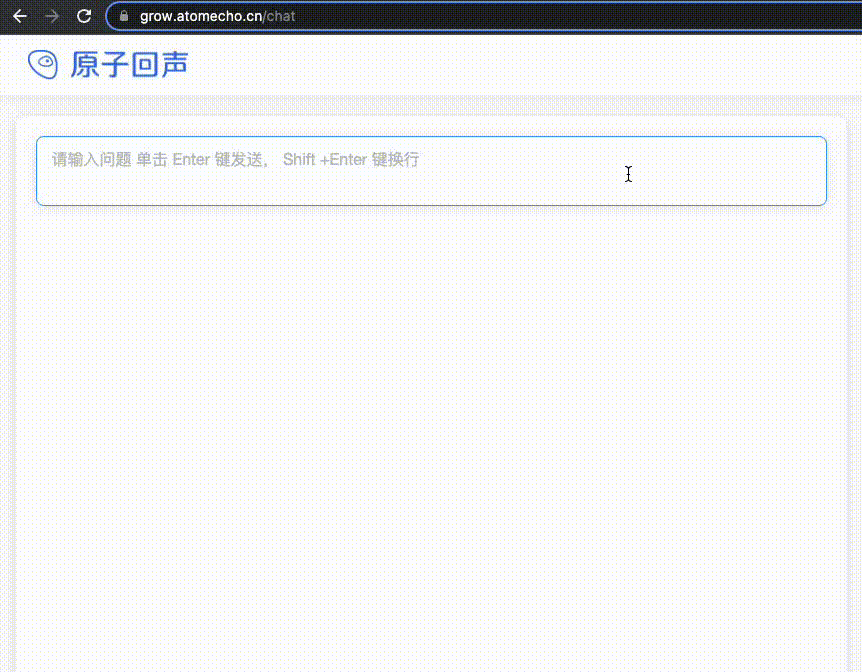

<h1 align="center">AtomGPT</h1>
<h4 align="center">
    <p>
        <a href="https://github.com/AtomEcho/AtomGPT/blob/main/README_EN.md">English</a> |
        <b>中文</b>
    <p>
</h4>
为了能够在中文上训练出一个能够和ChatGPT能力接近的中文大模型，我们开放了AtomGPT项目

AtomGPT基于LLaMA的模型架构，从0开始训练，希望能在训练的过程中，将模型能力得到提升的进化过程展示出来，感受到模型学习的过程。

(ps:各位大佬，如果本项目能给您带来一点点帮助，麻烦点个⭐️吧)

## 模型在线体验平台
能够更加直观可视化出模型训练的过程中模型能力的变化，以及方便进行测试，我们搭建了AtomGPT模型成长平台。

在该平台上，我们提供了一个在线测试入口，点击右上角体验一下，注册登录即可体验（ps:当前显卡资源有限，有时会出现排队的情况）

体验地址：[https://grow.atomecho.cn/](https://grow.atomecho.cn/)

</img>

## 最近更新

### 动态

- 2023.06.13 添加了示例gunicorn server 的示例代码
- 2023.06.09 添加支持langchain的llm实现
- 2023.06.01 儿童节快乐，我们开始将我们的模型推送到🤗model hub。
- 2023.05.13 进行了模型训练的第一次点火测试。
- 2023.04.28 我们决定了要训练出一个能够与ChatGPT能力接近的中文大模型。

### 预训练模型更新
- 2023.06.01 开放出预训练第8000步的模型


### chat模型更新
- 2023.06.01 开放出在第8000步的预训练模型基础上，通过lora进行指令微调的单轮对话模型


## 训练细节
我们基于transformers实现的LLaMA模型代码，参考meta开源的13B的模型配置，作为实现AtomGPT的开始。训练过程中使用了10台8卡A100的机器，在bf16的精度上，进行了预训练的过程。

该过程持续进行中……

数据来源方面，主要包含以下几方面的数据:

1. 中文数据
中文数据作为了预训练的主要数据部分，主要来源有以下几个部分
- 由原子回声从互联网上抓取的网络数据，这部分原始数据约100T，挑选出去重后的高质量中文数据，涉及到百科，书籍，博客，新闻，公告，小说，公众号等高质量长文本数据。这部分数据还在清洗更多逐步加入到模型中
- 中文Wikipedia的数据
- 中文悟道开源的200G数据
- clue开放的中文预训练数据，进行清洗后的高质量中文长文本数据
- 近年来中文自然语言处理多任务竞赛数据集，约150个
- [MNBVC](https://github.com/esbatmop/MNBVC) 中清洗出来的部分数据集

2. 其他语言数据（以英文为主）
- wiki_en
- openwebtext
- c4

3. 代码数据
为了能够提高模型的代码生成能力，我们添加了🤗开源的大量代码数据集
- codeparrot/github-code-clean
- codeparrot/apps
- huggingface-course/codeparrot-ds-train
- code_search_net
- Bigcode-the-stack-dedup

4. 持续更新
- 希望大家如果有较高质量的数据集能够提供给我们，不胜感激

## 模型下载
可以在🤗Model Hub下载以下所有模型

### 预训练模型

AtomGPT预训练模型使用transformers 直接加载就可以。4bit压缩模型需要使用[AutoGPTQ](https://github.com/PanQiWei/AutoGPTQ/blob/main/README_zh.md)进行加载

模型名称|🤗模型加载名称|下载地址
--|--|--
AtomGPT_8k|AtomEchoAI/AtomGPT_8k|[模型下载](https://huggingface.co/AtomEchoAI/AtomGPT_8k)

### chat模型
AtomGPT-chat模型需要使用transformers进行加载。4bit压缩版本模型需要使用[AutoGPTQ](https://github.com/PanQiWei/AutoGPTQ/blob/main/README_zh.md)进行加载

模型名称|🤗模型加载名称|下载地址
--|--|--
AtomGPT_8k_chat|AtomEchoAI/AtomGPT_8k_chat|[模型下载](https://huggingface.co/AtomEchoAI/AtomGPT_8k_chat)
AtomGPT_8k_chat_4bit|AtomEchoAI/AtomGPT_8k_chat_4bit|[模型下载](https://huggingface.co/AtomEchoAI/AtomGPT_8k_chat_4bit)
## 本地推理与快速部署

### 推理硬件要求
模型 | 显存要求
--|--
16bit | 至少32G显存(V100,A100等)
8bit | 至少24G显存(3090等)
4bit | 至少12G显存(3060等)

### gradio快速搭建问答平台

基于gradio搭建的问答界面，实现了流式的输出。
```
python example/atomgpt_chat.py --model_name_or_path AtomEchoAI/AtomGPT_checkpoint_8k_chat
```
4bit模型加载如要 --is_4bit

```
python example/atomgpt_chat.py --model_name_or_path AtomEchoAI/AtomGPT_8k_chat_4bit --is_4bit
```

### docker部署问答接口

正在准备

### transformers调用代码示例
#### 8bit版本
```
from transformers import AutoTokenizer, AutoModelForCausalLM
model = AutoModelForCausalLM.from_pretrained('AtomEchoAI/AtomGPT_checkpoint_8k_chat',device_map='auto',torch_dtype=torch.float16,load_in_8bit=True)
model =model.eval()
tokenizer = AutoTokenizer.from_pretrained('AtomEchoAI/AtomGPT_checkpoint_8k_chat',use_fast=False)
input_ids = tokenizer(['<s>Human: 介绍一下北京\n</s><s>Assistant: '], return_tensors="pt",add_special_tokens=False).input_ids.to('cuda')        
generate_input = {
    "input_ids":input_ids,
    "max_new_tokens":512,
    "do_sample":True,
    "top_k":50,
    "top_p":0.95,
    "temperature":0.3,
    "repetition_penalty":1.3,
    "eos_token_id":tokenizer.eos_token_id,
    "bos_token_id":tokenizer.bos_token_id,
    "pad_token_id":tokenizer.pad_token_id
}
generate_ids  = model.generate(**generate_input)
text = tokenizer.decode(generate_ids[0])
print(text)
```
#### 4bit版本
```
from transformers import AutoTokenizer
from auto_gptq import AutoGPTQForCausalLM
model = AutoGPTQForCausalLM.from_quantized(args.model_name_or_path, device="cuda:0")
tokenizer = AutoTokenizer.from_pretrained('AtomEchoAI/AtomGPT_checkpoint_8k_chat',use_fast=False)
input_ids = tokenizer(['<s>Human: 介绍一下北京\n</s><s>Assistant: '], return_tensors="pt",add_special_tokens=False).input_ids.to('cuda')        
generate_input = {
    "input_ids":input_ids,
    "max_new_tokens":512,
    "do_sample":True,
    "top_k":50,
    "top_p":0.95,
    "temperature":0.3,
    "repetition_penalty":1.3,
    "eos_token_id":tokenizer.eos_token_id,
    "bos_token_id":tokenizer.bos_token_id,
    "pad_token_id":tokenizer.pad_token_id
}
generate_ids  = model.generate(**generate_input)
text = tokenizer.decode(generate_ids[0])
print(text)
```

## 常见问题列表
1. huggingface 上模型下载较慢？

· 我们提供位于中国国内的下载位置：正在准备

## 局限性
虽然本项目中的模型具备一定的中文理解和生成能力，但也存在局限性，包括但不限于：

- 可能会产生不可预测的有害内容以及不符合人类偏好和价值观的内容
- 由于算力和数据问题，相关模型的训练并不充分，中文理解能力有待进一步提升

## 致谢

正在准备

## 免责声明
本项目遵循apache-2.0的开源协议。使用涉及第三方代码的部分时，请严格遵循相应的开源协议。模型生成的内容受模型计算、随机性和量化精度损失等因素影响，本项目不对其准确性作出保证。对于模型输出的任何内容，本项目不承担任何法律责任，亦不对因使用相关资源和输出结果而可能产生的任何损失承担责任。
## 问题反馈
如有问题，请在GitHub Issue中提交。或者添加开发者的微信：zhangzheng-thu

在提交问题之前，请先查看FAQ能否解决问题，同时建议查阅以往的issue是否能解决你的问题。

礼貌地提出问题，构建和谐的讨论社区。


[](https://star-history.com/#AtomEcho/AtomGPT&Date)
