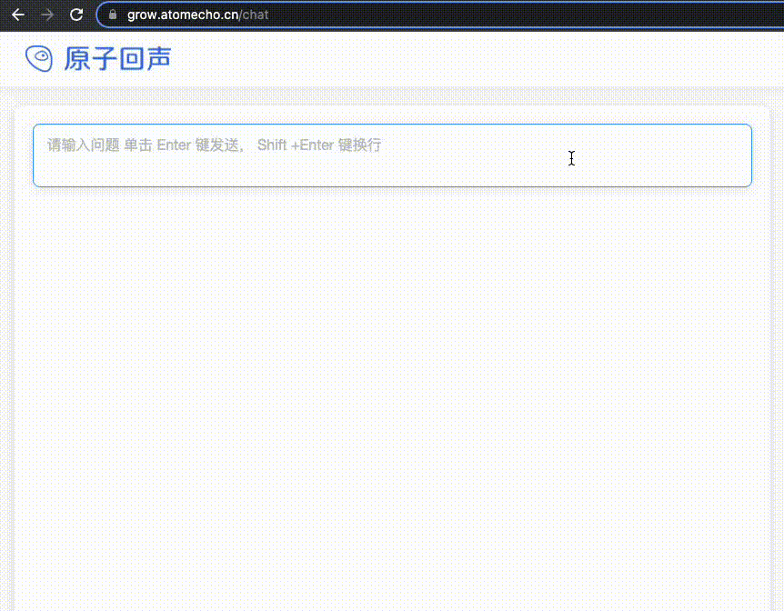

<h1 align="center">AtomGPT</h1>
<p align="center" width="100%">
</a>
</p>
<h4 align="center">
    <p>
        <b >English</b> |
        <a href="https://github.com/AtomEcho/AtomGPT/blob/main/README.md">中文</a> |
        <a href="https://github.com/AtomEcho/AtomGPT/assets/45086558/bd866c42-d952-4481-87ba-216f3012a283">WeChat</a>
    <p>
</h4>

This article is generated by AtomGPT based on the Chinese readme. 🎉🎉🎉(If there are any translation errors, please be understanding)

​To be able to train a Chinese model that is similar in capability to ChatGPT, we have opened the AtomGPT project. 

The AtomGPT project is based on LLaMA’s model architecture and starts from scratch training with the aim of showing the evolution process of the model capabilities during training as well as experiencing the learning process of the models. 

(Ps: If this project can provide you with any help, please click “Like⭐️”.)

## Content Navigation
| Chapter                                       | Description                                                  |
| --------------------------------------------- | ------------------------------------------------------------ |
| [🌐Online experience platform](#🌐Online-experience-platform)         | Visually visualize the changes in model capabilities during model training  |
| [🔥Recent Updates](#🔥Recent-Updates)         | Our latest updates  |
| [📝Training Details](#📝Training-Details)         | Introduced the training details and data sources of the large model  |
| [⏬Download](#⏬Model-download)                         | Hugging face of large model 🤗 Download address                  |
| [🚀Model Fine-tuning](#🚀Model-Fine-tuning) |  This warehouse provides simple Lora based fine-tuning code |
| [💻Quick Deployment](#💻Local-Inference-and-Fast-Deployment)         | Steps for quantize and deploy LLMs on personal computers     |
| [💯TODO](#💯TODO)           | Introduced the work we need to do next                                |
| [❓Common Problem List](#❓Common-Problem-List)                                   | Replies to some common questions                             |
| [⚠️Limitations](#⚠️Limitations)                    | Limitations of the models involved in this project           |
## 🌐Online experience platform
The platform of AtomGPT model growth is built to visualize the change in capability during training and make it easier for testing. 

An online test portal has been provided, click on the right upper corner to experience (Note that there may be a queue due to limited GPU resources).

Experience Address: [https://grow.atomecho.cn/](https://grow.atomecho.cn/)

</img>

## 🔥Recent Updates

### Dynamic

- June 1st, Children’s Day! We are starting to push our model into Model Hub.
- May 13th - The first test of the training was conducted for the first time.
- April 28th - It has been decided that we will train a Chinese big model with ChatGPT capabilities close to it.
### Pre-Trained Model Update

- June 1st - Opened out pre-trained step 8000 on the basis of the model.
### Chat Model Update

- June 1st - Released a single turn dialogue model based on the pre-trained step 8000 and LORA commands microadjustment.


## 📝Training Details
We are using Transformers-based LLaMA models with the configuration of 13B from Meta, which is a starting point for implementing AtomGPT. The training process was conducted on 10 machines with 8 Nvidia A100 GPUs and BF16 precision.

The pre-training process continues…✌️✌️

Data sources include the following aspects: 

1. The Chinese data
The Chinese data is the primary training data for pretraining, which comes from several sources.
| Type       |  Description |
  | ---------- | -------- |
  | Network Data  | The network data captured from the Internet by the atomic echo is about 100T of original data. The high-quality Chinese data selected include encyclopedias, books, blogs, news, announcements, novels, official account and other high-quality long text data. This part of the data is still being cleaned and gradually added to the model. |
  | [Wikipedia](https://github.com/goldsmith/Wikipedia) | Chinese Wikipedia data |
  | [WuDao](https://github.com/BAAI-WuDao/Model)   | Chinese Wudao open-source 200G data |
  | [Clue](https://github.com/CLUEbenchmark/CLUEDatasetSearch)   | Clue's open Chinese pre training data, high-quality Chinese long text data after cleaning |
  | Competition dataset | In recent years, there are about 150 Chinese Natural language processing multi task competition data sets |
  | [MNBVC](https://github.com/esbatmop/MNBVC)   | Partial dataset cleaned from MNBVC |

2. Other language data (primarily in English)
| Type       | Description|
  | ---------- | -------- |
  | wiki_en   | Wikipedia - English |
  | openwebtext | Open source web text |
  | c4   | C4 uses many filters to filter text |

3. Code data
To improve the code generation ability of models, we added open-source large amounts of 🤗 data sets
| Type       | 
  | ---------- | 
  | codeparrot/github-code-clean   |  
  | codeparrot/apps |  
  | huggingface-course/codeparrot-ds-train   | 
  | code_search_net   |  
  | Bigcode-the-stack-dedup | 
4. Continuously update
- Please let us know if you have high-quality training data sets that we can use. We are grateful for your support and cooperation💕💕

## ⏬Model download
Download all models below on 🤗Model Hub

### Pre-training model

AtomGPT pre-training model can be used with Transformers directly loaded. 4-bit compressed models require loading [AutoGPTQ](https://github.com/PanQiWei/AutoGPTQ/blob/main/README.md) for loading

Model Name |🤗 Model Loading Name |Download Link
--|--|--
AtomGPT_8k|AtomEchoAI/AtomGPT_8k|[Model download](https://huggingface.co/AtomEchoAI/AtomGPT_8k)

### chat model
AtomGPT-chat model can be used with Transformers directly loaded. 4-bit compressed models require loading [AutoGPTQ](https://github.com/PanQiWei/AutoGPTQ/blob/main/README.md) for loading

Model Name |🤗 Model Loading Name |Download Link
--|--|--
AtomGPT_8k_chat|AtomEchoAI/AtomGPT_8k_chat|[Model download](https://huggingface.co/AtomEchoAI/AtomGPT_8k_chat)
AtomGPT_8k_chat_4bit|AtomEchoAI/AtomGPT_8k_chat_4bit|[Model download](https://huggingface.co/AtomEchoAI/AtomGPT_8k_chat_4bit)

## 🚀Model Fine-tuning

This warehouse provides simple Lora based fine-tuning code

### Environmental Preparation

According to [requirements. txt]（ https://github.com/AtomEcho/AtomGPT/blob/main/requirements.txt ）Install corresponding environment dependencies

### Data Preparation

A data sample for modeling SFT is provided under data/

#### Incorporate Q&A questions and answers into SFT training
This data has only one column
- training data：[data/train_sft.csv](https://github.com/AtomEcho/AtomGPT/blob/main/data/train_sft.csv)
- validation data：[data/dev_sft.csv](https://github.com/AtomEcho/AtomGPT/blob/main/data/dev_sft.csv)

#### Only the answer part of the Q&A is added to the SFT training
The data has two columns, the first column is the input and the second column is the output, that is, the dev_ A column of data in sft. csv is divided into two parts

- To be provided


### Fine tuning scripts

[train/sft/finetune_other.sh](https://github.com/AtomEcho/AtomGPT/blob/main/train/sft/finetune_other.sh)，fine tune the model by modifying some parameters of the script

## 💻Local Inference and Fast Deployment

### Requirements for hardware reasoning
Model | Memory Requirement for Hardware-based Inference
--|--
16 bit | At least 32GB of memory (e.g., V100 and A100)
8 bit | At least 24 GB of memory (e.g., 3090)
4 bit | At least 12 GB of memory (e.g., 3060)

### Gradio quickly builds a question-answer platform

Based on gradio, the interface of question and answer has been implemented with a streaming output<font color="#006600">Just modify the model name in the code for different models😊</font><br />
```
python examples/atomgpt_chat.py --model_name_or_path AtomEchoAI/AtomGPT_14k
```
The 4bit model is loaded as if it’s needed.  <font color="#006600">--is_4bit</font><br />

```
python examples/atomgpt_chat.py --model_name_or_path AtomEchoAI/AtomGPT_14k_chat_4bit --is_4bit
```

### Docker deployment question-answering interface

Getting ready

### Transformers code example
#### 8bit version
```
from transformers import AutoTokenizer, AutoModelForCausalLM
model = AutoModelForCausalLM.from_pretrained('AtomEchoAI/AtomGPT_14k',device_map='auto',torch_dtype=torch.float16,load_in_8bit=True)
model =model.eval()
tokenizer = AutoTokenizer.from_pretrained('AtomEchoAI/AtomGPT_14k',use_fast=False)
input_ids = tokenizer(['<s>Human: 介绍一下北京\n</s><s>Assistant: '], return_tensors="pt",add_special_tokens=False).input_ids.to('cuda')        
generate_input = {
    "input_ids":input_ids,
    "max_new_tokens":512,
    "do_sample":True,
    "top_k":50,
    "top_p":0.95,
    "temperature":0.3,
    "repetition_penalty":1.3,
    "eos_token_id":tokenizer.eos_token_id,
    "bos_token_id":tokenizer.bos_token_id,
    "pad_token_id":tokenizer.pad_token_id
}
generate_ids  = model.generate(**generate_input)
text = tokenizer.decode(generate_ids[0])
print(text)
```
#### 4bit verison
```
from transformers import AutoTokenizer
from auto_gptq import AutoGPTQForCausalLM
model = AutoGPTQForCausalLM.from_quantized('AtomEchoAI/AtomGPT_14k_chat_4bit', device="cuda:0")
tokenizer = AutoTokenizer.from_pretrained('AtomEchoAI/AtomGPT_14k_chat_4bit',use_fast=False)
input_ids = tokenizer(['<s>Human: 介绍一下北京\n</s><s>Assistant: '], return_tensors="pt",add_special_tokens=False).input_ids.to('cuda')        
generate_input = {
    "input_ids":input_ids,
    "max_new_tokens":512,
    "do_sample":True,
    "top_k":50,
    "top_p":0.95,
    "temperature":0.3,
    "repetition_penalty":1.3,
    "eos_token_id":tokenizer.eos_token_id,
    "bos_token_id":tokenizer.bos_token_id,
    "pad_token_id":tokenizer.pad_token_id
}
generate_ids  = model.generate(**generate_input)
text = tokenizer.decode(generate_ids[0])
print(text)
```
## 💯TODO
1. Add tool learning capabilities for models, open source AtomGPT tools
2. Add manual feedback into feedback to improve the stability of the chat model
3. Personalized fine-tuning platform to create customized digital avatars
4. Add multimodal capabilities and add eyes and ears to the model
5. Increase the context length of the model, such as using methods such as PCW. Currently[ https://arxiv.org/pdf/2306.15595.pdf ]（ https://arxiv.org/pdf/2306.15595.pdf ）High cost-effectiveness
6. Strengthen logical reasoning ability

## ❓Common Problem List
1. HugginFace downloads slowly？

· We provide a downloading location in China, which is being prepared.

## ⚠️Limitations
Although the models on this project have some Chinese understanding and generation capabilities, they also have limitations such as:

- They may produce harmful content that does not meet human preferences or values
- Due to computing power and data issues, related model training is insufficient, so there are still improvements needed for Chinese understanding

## 🎉Thanks

In preparation

## 😁Disclaimer
This project is based on the Apache 2.0 open source license. When using third-party code, please strictly follow the relevant open source agreements accordingly. The generated content of models may be affected by factors such as model calculation, randomness and quantization loss, etc., and this project does not guarantee its accuracy. Any output from the related resources and results are subject to legal liability for which the project shall bear no responsibility nor assume any obligation arising therefrom or in connection thereto.

## 🤔Feedback on problems
If you have any problems, please file an issue on GitHub. Or add the developer’s WeChat ID (zhangzheng-thu) to your contact list and send a message with details of your problem

Before filing issues, please check if FAQ can solve your problem first. It is also recommended that you review past issues for solutions to similar problems.

Please be polite when asking questions in order to create harmonious discussion communities,link with QR code at the beginning😍😍


[](https://star-history.com/#AtomEcho/AtomGPT&Date)
